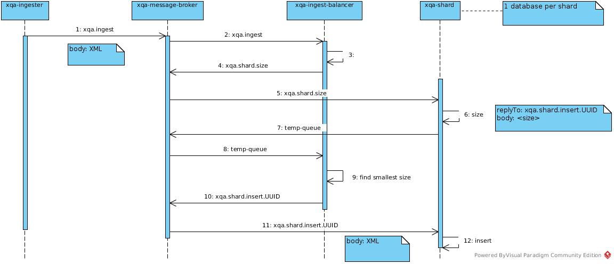

# xqa-shard-JMS  
an embedded in-memory BaseX instance with a JMS interface.

## 1. High Level Design

## 2. Maven
### 2.1. Clean .m2
* rm -rf $HOME/.m2/*

### 2.2. Test
* mvn clean test
* mvn -Ptest-integration-messagebroker test
* mvn -Ptest-integration-storage test
* mvn jacoco:report coveralls:report

### 2.3. Package
* mvn clean package -DskipTests

### 2.4. Run
* export JMS_Q_DEST=XXX
* mvn spring-boot:run --jms.queue.xqa.ingest=${JMS_Q_DEST}

or

* java -jar target/xqa-shard-1.0.0-SNAPSHOT.jar --jms.queue.xqa.ingest=${JMS_Q_DEST}

## 3. Docker
### 3.1. Build locally
* docker-compose -p "dev" build

or

* mvn clean install dockerfile:build

### 3.2. Bring up
* docker-compose -p "dev" up -d

### 3.3. Teardown
* docker-compose -p "dev" down --rmi all -v
